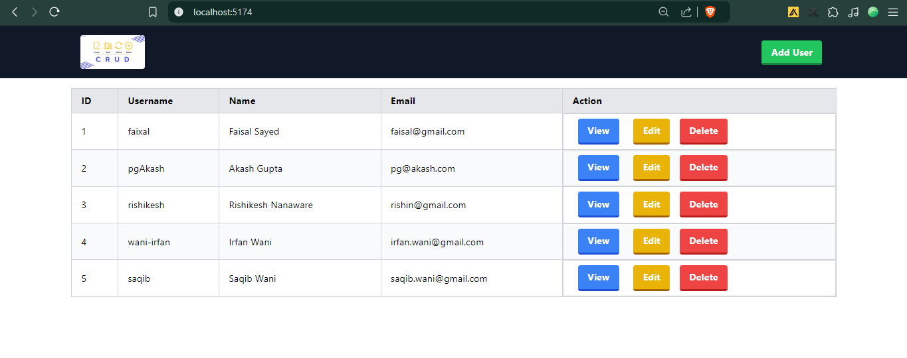
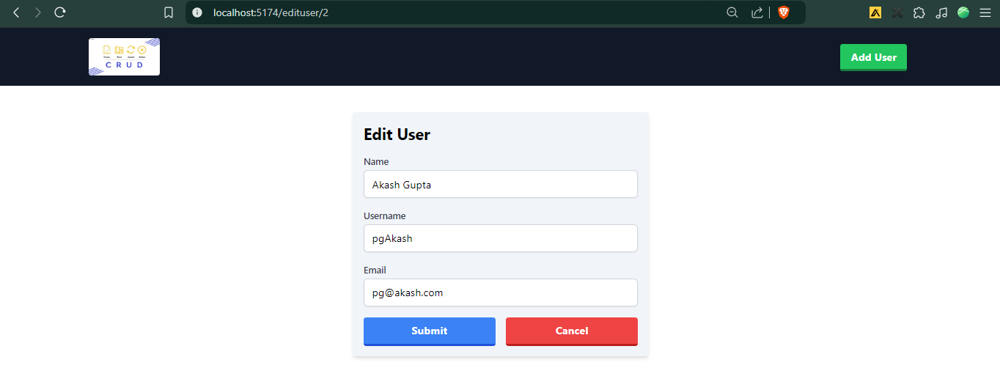
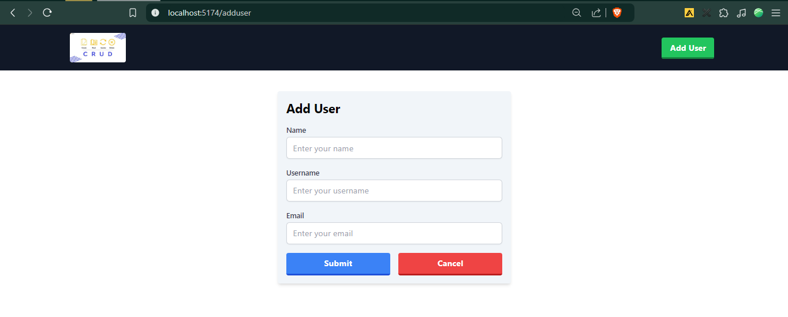

# Full Stack Application 🚀

A powerful and efficient Full Stack application that allows users to perform CRUD (Create, Read, Update, Delete) operations with a sleek user interface and robust backend.

## Tech Stack 🖥️

- **Backend:** Spring Boot 🏗️
- **Frontend:** ReactJS (Vite.js) ⚛️
- **Database:** MySQL 🗄️

## Features ✨

- **Create:** Add new records to the database 📑
- **Read:** View existing records 🧐
- **Update:** Modify records in the database ✍️
- **Delete:** Remove records from the database ❌

## Screenshots 📸

### Home Screen 🏠



### View User Screen 👀


### Edit User Screen ✏️



### Add User Screen ➕



## Setup Instructions ⚙️

### 1. Clone the repository

```bash
git clone https://github.com/your-username/full-stack-application.git
cd full-stack-application
```

### 2. Backend Setup (Spring Boot) 🏗️

- Navigate to the backend folder:

```bash
cd backend
./mvnw clean install
```

- Start the Spring Boot application:
  bash

```bash
./mvnw spring-boot:run
```

### 4. 3. Frontend Setup (ReactJS with Vite) ⚛️

- Navigate to the frontend folder:

```bash
cd frontend
```

Install dependencies:

```bash
npm install
```

- Start the React application:

```bash
npm run dev
```

### 4. Database Setup (MySQL) 🗄️

- Make sure MySQL is installed and running on your machine.
- Create a new database for the application:

```sql
CREATE DATABASE full_stack_app;
```

- Update the database configuration in the application.properties file in the backend:

```java
spring.datasource.url=jdbc:mysql://localhost:3306/full_stack_app
spring.datasource.username=your-username
spring.datasource.password=your-password
```

- Running the Application 🌐
  Once everything is set up, you can access the frontend at:

```bash
http://localhost:3000
```

-The backend API will be available at:

```bash
http://localhost:8080
```

### Contributing 🤝

- Fork the repository
- Create a new branch (git checkout -b feature-name)
- Make your changes
- Commit your changes (git commit -am 'Add new feature')
- Push to the branch (git push origin feature-name)
  -Open a pull request
